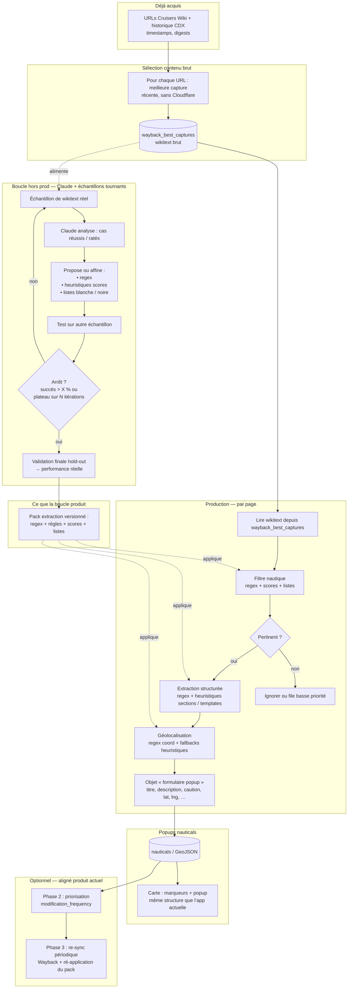

# Vision complète — Extraction nauticals hybride (regex + heuristiques + boucle Claude)

Document de synthèse : du moment où les **URLs** et les **captures d’archives** sont connues jusqu’à la **fabrication des popups nauticals** sur la carte.

---

## Schéma global

---

## Lecture en langage naturel

1. **Entrée** : liste d’URLs et historique des captures (CDX) déjà construits.
2. **Sélection** : pour chaque URL, choix de la **meilleure archive** (pas Cloudflare, la plus récente) → stockage du **wikitext brut** (ex. `wayback_best_captures`).
3. **Boucle (hors ligne)** : sur des **échantillons tournants**, Claude aide à définir et affiner **regex + heuristiques** (scores, listes blanche/noire). Tests, mesure, **critères d’arrêt** (taux de succès > X % ou plateau sur N itérations), puis **validation finale** sur un hold-out → **pack d’extraction versionné**.
4. **Production** : pour chaque page, application **uniquement** du pack (peu ou pas d’appels Claude) : filtre « instructions nautiques », champs type formulaire popup, géolocalisation.
5. **Sortie** : persistance en base (`nauticals`) et affichage **popups** sur la carte comme aujourd’hui.
6. **En option** : **Phase 2** (priorisation) et **Phase 3** (mises à jour périodiques), en **ré-appliquant** le même pack sur le wikitext mis à jour.

---

## Rôle des briques

| Élément | Rôle |
|--------|------|
| **Regex** | Coordonnées, sections, templates, motifs répétitifs dans le wikitext. |
| **Scores** | Pondérer la pertinence (mots-clés, présence de sections attendues, etc.). |
| **Listes blanche / noire** | Titres, namespaces, préfixes de page, mots d’exclusion. |
| **Claude** | Surtout **dans la boucle** : proposer et affiner regex + heuristiques — **pas** sur chaque page en production (sauf filet de sécurité ou cas rares si on le décide plus tard). |

---

## Objectif économique

- **Boucle** : échantillon → Claude → regex/heuristiques → tests → amélioration → échantillon tournant → arrêt → validation réelle.
- **Prod** : **économiser les appels Claude** sur le traitement « filtrer / structurer / géolocaliser » en encodant le résultat de la boucle dans un **pack déterministe** (regex + règles).

---

## Note sur le rendu Mermaid

Les diagrammes Mermaid sont visibles dans GitHub, dans certains IDE (preview Markdown), et dans des outils comme [Mermaid Live Editor](https://mermaid.live).

## Implémentation et workflow opérationnel

- Moteur et schéma JSON : `lib/nautical-extraction-pack.ts`, `data/nautical-extraction-pack.default.json`
- Export d’échantillons, validation gold, prompts : **[EXTRACTION_PACK_WORKFLOW.md](EXTRACTION_PACK_WORKFLOW.md)**
