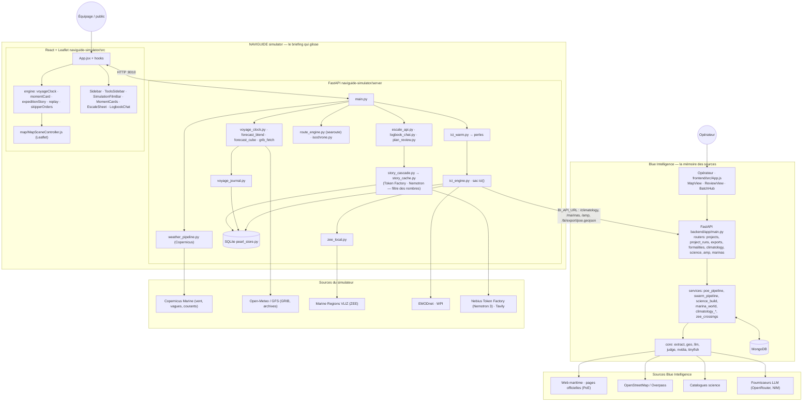

# L'esprit de l'application — ce qu'elle veut faire, et comment elle y arrive

Version **1.0** — 20 septembre 2026. Ce texte sert à trois choses : relire
les **diagrammes générés depuis le dépôt** (ils doivent raconter cette chaîne,
sinon ils sont faux), écrire la **description Devpost**
(`HACKATHON_DEVPOST_SOUMISSION.md`), et donner à un agent la carte mentale
avant d'ouvrir un fichier. Références de code entre parenthèses.

## 1. Ce que l'application veut faire

Un équipage qui fait le tour du monde n'a pas besoin d'un chatbot. Il a besoin
d'une **carte** et d'un **briefing** : où suis-je, qu'y a-t-il autour de moi
qui compte (une frontière maritime, un port d'entrée officiel, une aire
protégée, un coup de vent, une station scientifique, une escale et ses
services), et **qu'est-ce que le système ne sait pas**. L'application
NAVIGUIDE simulator fait ce travail pour l'expédition Berry-Mappemonde
(départ de Saint-Maur le 15 mai 2026, La Rochelle, les territoires français
d'outre-mer, retour à La Rochelle), et pour n'importe quelle route qu'on
dessine. Blue Intelligence, l'autre produit, est la **mémoire des sources**
(projets, marinas, capitaineries, ports d'entrée, aires marines protégées,
couches océan) que le simulateur interroge.

Trois principes tiennent tout :

1. **Les faits viennent des sources.** Un LLM rédige, choisit, relie, juge ;
   il ne produit jamais un nombre. Champ inconnu = vide.
2. **Le bateau glisse, on ne clique pas.** Le temps est une horloge ; la carte
   suit ; les informations arrivent quand elles comptent (cartes NOW) ou quand
   il y a un moment libre (cartes FREE).
3. **`main` est le plancher.** Une surface visible ne disparaît jamais pour
   simplifier un chantier.

## 2. La chaîne de traitement, du monde à l'écran

```
SOURCES ──► COLLECTE ──► MÉMOIRE ──► ÉCHANTILLON « ici » ──► JUGE ──► CARTES ──► RÉCIT / VOIX ──► ÉCRAN
   │            │            │              │                  │         │            │              │
 océan,      perles       SQLite        sac du moment       NOW/FREE   NOW/FREE   règles puis    carte, sidebars,
 pages       riches      (pearls,       (rayon 60 nm,       Gold,      + liens    Nemotron ;     barre film,
 officielles, journal     kv), MongoDB   30 nm en sim.)      seuils,    officiels  filtre des     bulle, chat,
 ports, AMP,  climato     (Blue Intel.)                      distances             nombres        journal
 GRIB, atlas
```

### 2.1 Sources (rien n'est inventé)

| Famille | Sources | Où dans le code |
|---|---|---|
| Frontières et souveraineté | ZEE VLIZ/Marine Regions (polygones locaux), ports d'entrée officiels **Gold** (pages gouvernementales, pipeline Blue Intelligence) | `server/zee_local.py`, `backend/poe.py`, `/bi/export/poe.geojson` |
| Ports et services | WPI (World Port Index), marinas et capitaineries (OSM Overpass + enrichissement), mouillages | `backend/marina_world.py`, `server/escale_api.py` |
| Protection et science | aires marines protégées, stations et campagnes scientifiques, projets maritimes | `server/ici_engine.py` (`amp`, `science`, `projects`) |
| Balisage, fonds | balisage (AtoN), EMODnet bathymétrie / substrats / câbles | `ici_engine.py` (`aton`), couches carte |
| Météo et mer | GRIB de prévision (cube), Copernicus Marine (vent, vagues, courants pour la popup satellite), atlas de climatologie (roses, cyclones) | `server/forecast_cube.py`, `weather_composite.py`, `climatology_atlas.py` |
| Le bateau | polaire du catamaran, route officielle (1 248 points), marques d'escale, ordres du skipper | `server/voyage_clock.py`, `src/engine/skipperOrders.js` |

### 2.2 Collecte : les perles

La route est échantillonnée en **perles** (une tous les ~30 nm). Pour chaque
perle, le serveur remplit un **dossier** : ZEE, PoE, AMP, projets, ports,
balisage, science, climatologie du mois (`fill_dossier`, `ici_engine.py`).
Une perle « mince » a l'essentiel ; une perle « riche » a tout ce qui est
intemporel. Le réchauffage tourne en tâche de fond (`ici_warm.py`) et
persiste dans SQLite (`pearl_store.py`) : l'application tient debout sans
réseau et répond en millisecondes.

### 2.3 Horloge : où est le bateau, à quelle vitesse

Le temps n'est pas un curseur arbitraire : `build_voyage_clock` intègre la
route point par point avec la vitesse polaire au vent du moment, les jours à
quai, le tronçon route et le saut avion. Aujourd'hui le passé est calculé à
la climatologie ; la cible (`PLAN_AUDIT_CALCULS.md`) est **trois régimes** :
hindcast (ce que le bateau a rencontré), prévision (7 jours), climatologie
(ensuite), et **une seule vitesse** partout.

### 2.4 « ici » : le sac du moment

À chaque instant, `ici()` prend la perle la plus proche (ou en calcule une,
en Simulation, 30 nm devant) et en fait le **sac** : ce qui est autour du
bateau, à quelle distance, avec quelles sources. C'est le seul objet que
voient les étapes suivantes — jamais « la carte entière ».

### 2.5 Juge : NOW ou FREE, Gold ou pas

Des **règles** (pas un LLM) classent chaque élément du sac (`momentCard.js`) :
**NOW** = sécurité et décision (ZEE franchie, PoE Gold, AMP, coup de vent,
balisage, escale, climatologie qui change) ; **FREE** = culture et contexte
(science, projets, EMODnet). Gold = page officielle vérifiée. Seuils et
distances sont dans `REGLES_PARAMETRES.md`. Le plan Nemotron ajoute un
**juge de vérité** : Tavily relit la page officielle, Nemotron 3 Ultra barre
ce qui n'est plus prouvé — il ne réécrit rien.

### 2.6 Cartes : ce qu'on voit

Une carte NOW s'affiche, met le film en pause en Suivre, se lit d'un coup
d'œil, a ses liens (voir sur la carte, site officiel, Google Maps). Les cartes
FREE tournent quand il n'y a rien d'urgent. Le plan film les fait aussi
sortir **du bateau** (bulle) pendant « Revoir l'expédition ».

### 2.7 Récit et voix

Le journal (`voyage_journal.py`) garde tout : escales, ZEE, AMP, PoE,
événements météo, notes, échanges du chat. Le récit de l'expédition
(`expeditionStory.js`) se construit d'abord par **règles** (chronologie,
GRIB, événements), puis — en option — est **rédigé** par Nemotron 3 Super via
Nebius Token Factory, avec un filtre qui refuse tout nombre absent des faits
(`filter_numbers`). La voix (Web Speech) lit ce texte ; dans le film de
2 min 30, c'est elle qui donne le rythme au bateau.

### 2.8 Écran : trois modes, deux panneaux, une barre

- **Suivre l'expédition** : la position d'aujourd'hui, la caméra qui suit,
  les cartes NOW qui mettent en pause, **Revoir l'expédition** (le film).
- **Simulation** : la même horloge, avancée à la demande ; les ordres du
  skipper (vent max, Hs max) recalculent la route (isochrones) ; la date de
  départ est celle du jour et se change.
- **Tracer ma route** : on dessine, `searoute` relie, `ici()` remplit, les
  mêmes cartes apparaissent.
- Panneau gauche = **ici** (chat journal de bord, carte NOW, briefing, récit).
  Panneau droit = **l'expédition** (résumé, escales et fiches, revue de plan,
  polaire, calques, ordres). Barre film = temps, modes, voix, replay.

## 3. Le diagramme généré depuis le dépôt (20 sept.) : ce qui est juste, ce qui manque

Le porteur a fait produire un diagramme d'architecture par un outil d'analyse
du dépôt (cinq bandes : User Experience, Blue Intelligence API, NAVIGUIDE
Runtime, Data Intelligence, External Systems). Vérification fichier par
fichier contre le code :

**Juste (Blue Intelligence).** Les fichiers existent et les flèches sont
bonnes : `frontend/src/App.js` → `ReviewView.js`, `BatchHub.js`, `MapView.js`,
panneaux de mode ; `backend/app/main.py` (le « REST Server ») → routeurs
(`backend/app/routers/project_runs.py`, `exports.py`, `climatology.py`…) →
services (`backend/app/services/poe_pipeline.py`, `swarm_pipeline.py`,
`science_build.py`, `climatology_*.py`) → cœur (`backend/app/core/extract.py`,
`geo.py`, `llm.py`, `judge.py`) → MongoDB, web maritime, fournisseurs LLM,
catalogues science, OpenStreetMap. Remarque : `backend/server.py` n'a plus
que 5 lignes ; l'application est `backend/app/` — `docs/ARCHITECTURE.md`
est en retard sur ce point.

**Faux ou trompeur (NAVIGUIDE).**

1. `Risk Engine [risk_engine.py]` n'appartient pas au simulateur : le fichier
   est `naviguide/naviguide_workspace/naviguide_agent3/risk_engine.py`, un
   **ancien agent NAVIGUIDE** hors produit. Le simulateur n'a pas de moteur de
   risque ; ses « risques » sont les cartes NOW par règles et le conseil de
   route par isochrones.
2. `Plan Review [usePlanReview.js]` est un **hook React** (client) posé parmi
   les moteurs serveur ; le serveur est `server/plan_review.py`.
3. `Nearby Context → reads nearby data → MongoDB` : **faux**. Le simulateur ne
   touche pas MongoDB (`pearl_store.py` : « Pas de MongoDB côté simulateur »).
   Il interroge l'API Blue Intelligence en HTTP (`BI_API_URL`,
   `/climatology/point`, `/marinas`, `/amp`, `/bi/export/poe.geojson`).
4. Il manque **toute la chaîne du § 2** : la mémoire SQLite (`pearl_store.py`),
   le réchauffage des perles (`ici_warm.py`), l'horloge (`voyage_clock.py`,
   `forecast_blend.py`, `forecast_cube.py`, `grib_fetch.py`), le journal
   (`voyage_journal.py`), les ZEE locales (`zee_local.py`), les isochrones
   (`isochrone.py`), la fiche d'escale (`escale_api.py`), le chat
   (`logbook_chat.py`), la cascade LLM et son cache (`story_cascade.py`,
   `story_cache.py`), la météo Copernicus (`weather_pipeline.py`), et côté
   client les moteurs purs (`voyageClock.js`, `momentCard.js`,
   `expeditionStory.js`, `replay.js`) et la carte Leaflet
   (`MapSceneController.js`).
5. Il manque des **systèmes externes** du simulateur : Copernicus Marine,
   Open-Meteo / GFS (GRIB), Marine Regions (VLIZ), EMODnet, WPI, et — à venir —
   Nebius Token Factory et Tavily.
6. Le « Navigator » est à la fois l'utilisateur de Blue Intelligence et le
   skipper du simulateur ; en réalité deux publics : l'**opérateur** (revue,
   lots, console) côté Blue Intelligence, l'**équipage / le public** côté
   simulateur.

### Diagramme corrigé (à comparer à celui de l'outil)



Ce qu'un diagramme juste doit montrer, en quatre points : (1) **deux
produits** reliés par l'API HTTP de Blue Intelligence, pas par une base
commune ; (2) la chaîne du § 2 avec **SQLite au milieu** côté simulateur et
MongoDB côté Blue Intelligence ; (3) les LLM **en bout de chaîne**, derrière
un cache et un filtre, jamais en amont des faits ; (4) le client qui tient
debout seul (repli « les couches n'ont pas répondu »). Un diagramme qui met
un LLM au centre, un moteur de risque inexistant, ou une flèche du
simulateur vers MongoDB, est faux.

## 4. Ce qui distingue le produit (pour le jury)

Pas un chatbot : un **sac de 60 nm** échantillonné sur une vraie route, jugé
par des règles, raconté par un modèle qui n'a pas le droit d'inventer un
chiffre, revérifié à la source quand ça compte, et **regardable** — un bateau
qui glisse, une voix, des bulles — plutôt que 70 clics.
